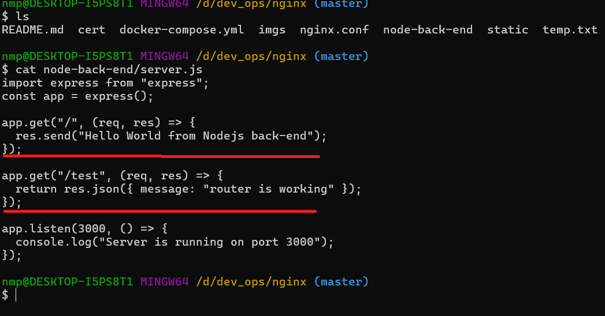
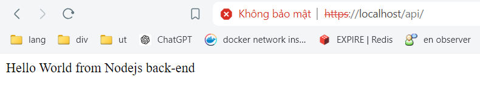

# how actually deploy api-service or web-app with nginx

1.In reality we have a lot of work to do to be able to run a service:

- buy a domain
- rent a vps
- point domain to ip
- create ssl/tls cert
- setup firewall for protocol & port
- change ssh connect authentication mechanism
- install git
- monitoring & warning message

### In this article, we will ignore the above content and use docker to simulate nginx and node api setups running in a local environment.

### prepare for installing :

1. create tls cert, if u install git in your system run this code :

```
openssl genpkey -algorithm RSA -out server.key -aes256
openssl req -new -key server.key -out server.csr
openssl x509 -req -days 365 -in server.csr -signkey server.key -out server.crt
```

2. get nginx config file :

```
docker run --rm -it -v .:/home nginx sh -c "cp /etc/nginx/nginx.conf /home"
```

we get :


change this file to [config file ](./nginx.conf)

3.create static folder with index.html have content:


4.create nodejs server with 2 endpoint



5.write compose file [](./docker-compose.yml) content:

```
version: '3.8'
services:
  minginx:
    image: nginx
    container_name: mi-nginx
    ports:
      - "127.0.0.1:443:443"
    volumes:
      - //d/dev_ops/nginx/nginx.conf:/etc/nginx/nginx.conf
      - //d/dev_ops/nginx/cert:/etc/nginx/ssl
      - //d/dev_ops/nginx/static:/usr/share/nginx/html
    depends_on:
      - minode-app
    networks:
      minode-network:
        ipv4_address: 172.21.0.2

  minode-app:
    image: bitnami/node
    container_name: minode-app
    expose:
      - "3000"
    volumes:
      - //d/dev_ops/nginx/node-back-end:/app
    networks:
      minode-network:
        ipv4_address: 172.21.0.3
    command: bash -c "cd /app && npm i && node server.js"
networks:
  minode-network:
    driver: bridge
    ipam:
      config:
        - subnet: 172.21.0.0/16
```

that file before use absolute path if u want use that config change your path setup

6. now docker compose up, open browse and test

my config :


enter localhost in search bar and result:

landing page :


api service :


